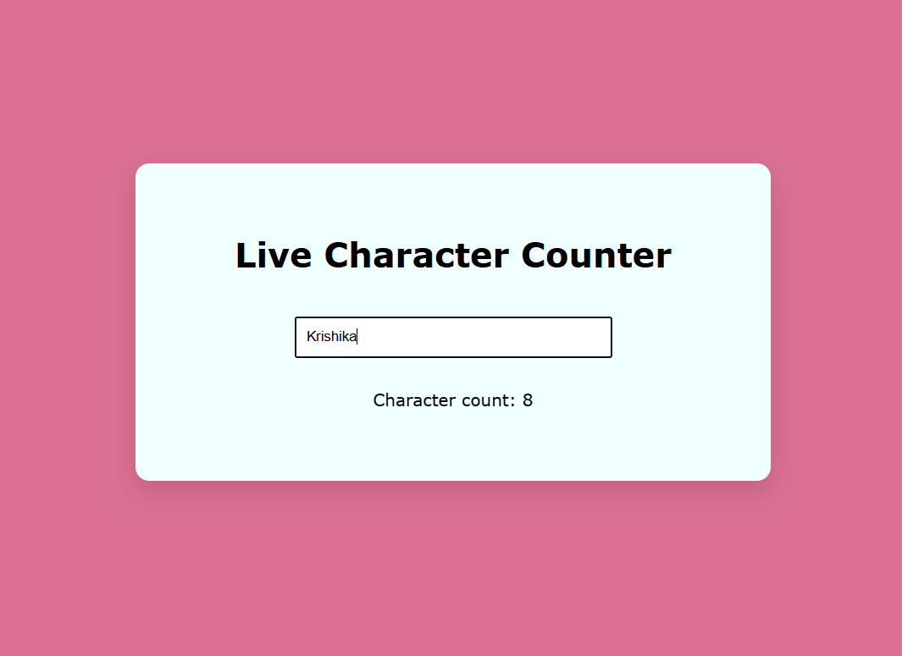

✨ Live Character Counter

A simple Live Character Counter built using HTML, CSS, and JavaScript.
It counts characters in real-time as the user types.

🚀 Features

Live character counting while typing

Clean and modern UI

Centered layout using Flexbox

Smooth card shadow design

🛠️ Tech Stack

HTML

CSS

JavaScript

📸 Screenshot

▶️ How to Run

Download / clone the project

Open index.html in your browser

🌟 Author

Made with ❤️ by Krishika